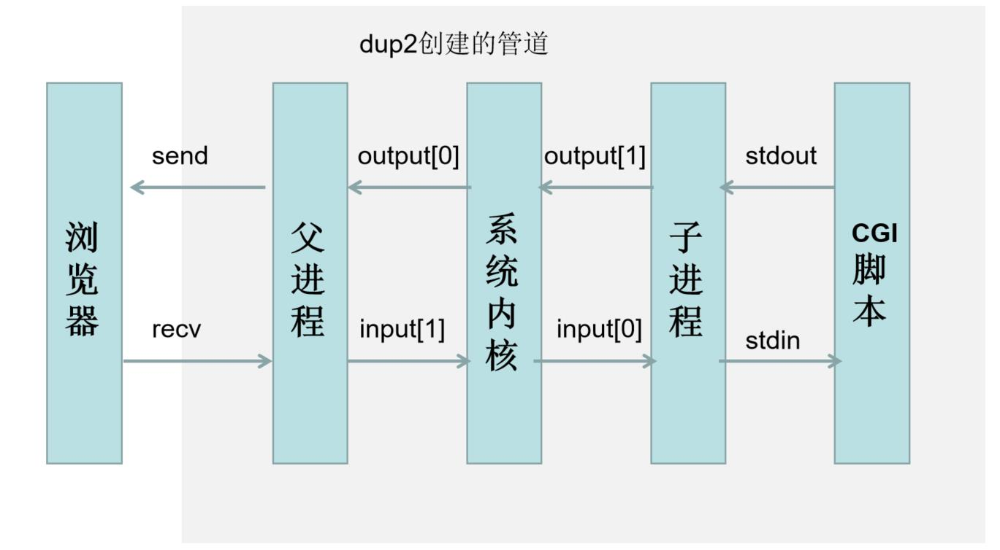
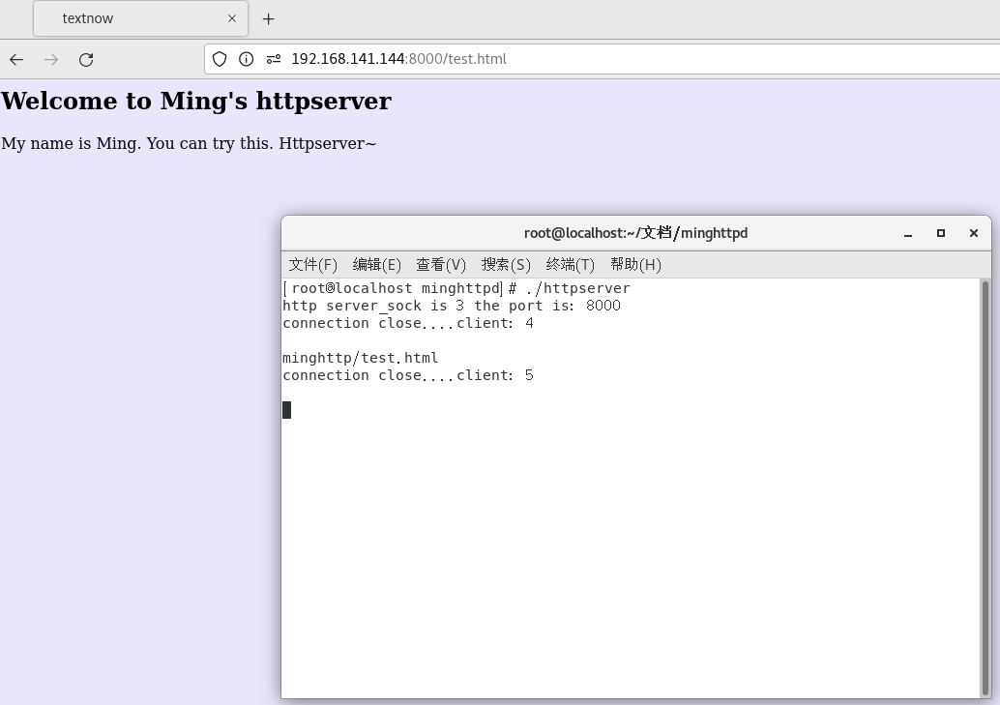
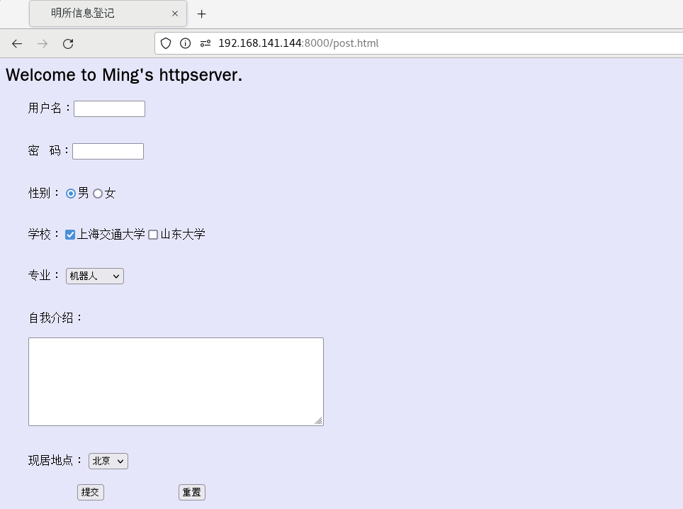

# minghttpd
<h3 align="center"> 基于C++的HTTP服务器 </h3>

### 1、技术基础
&emsp;基础架构：基于Linux的多线程HTTP服务器，支持静态资源访问与动态消息回显：\

&emsp;技术运用：\
&emsp;&emsp;1）针对HTTP捕获GET POST方法，基于cgi脚本(python撰写)实现post请求响应；\
&emsp;&emsp;2）利用html撰写请求或者读取测试界面，利用多线程服务增加并发性能；\
&emsp;&emsp;3）双管道实现进程间通信；\
&emsp;&emsp;4）待做：IO复用以及线程池的运用。
### 2、成果介绍
&emsp;&emsp;1）项目默认端口号为8000，ip地址需要通过ifconfig进行查看；\
&emsp;&emsp;2）将ip和端口号进行替换输入，如下输入后可以得到如下界面：\

&emsp;&emsp;3）POST的界面信息：\

&emsp;&emsp;4）POST的CGI脚本回显，基于python进行撰写，内容传输为html语言：\

### 3、编译执行
&emsp;&emsp;进入linux系统后，进入当前文件夹，首先修改可执行权限，然后通过CMake编译执行即可：\
~~~c
cd  minghttp
chmod 600 test.html
chmod 600 post.html
chmod +X post.cgi
cd ..
cmake .
make
./httpserver
~~~
### 4、参考借鉴
&emsp;1）源码出处：https://sourceforge.net/projects/tiny-httpd/ \
&emsp;2）《Linux高性能服务器编程》-中国-游双
